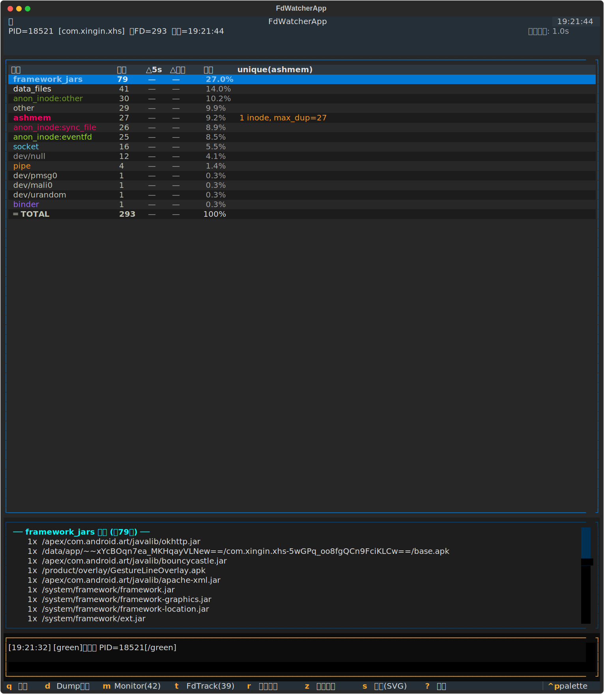

<div align="right">
  <a href="README.md">English</a> | <a href="README.zh-CN.md">中文</a>
</div>

<div align="center">
  <h1>Android Perf TUI Toolkit</h1>
  <p>Real-time Android performance monitoring TUI tools — fd leak detection + CPU instruction profiling.</p>

  <p>
    
    
    
    
  </p>
</div>

<div align="center">
  
</div>

---

## Tools

| Tool | Description |
|---|---|
| **[fd_watcher](#fd_watcher)** | Real-time fd distribution monitor — catch ashmem leaks |
| **[cpu_watcher](#cpu_watcher)** | Real-time function-level CPU instruction profiler via simpleperf |

---

## fd_watcher

### Features

| | |
|---|---|
| **Real-time fd distribution** | Reads `/proc/<pid>/fd` via adb at configurable intervals |
| **Type classification** | ashmem / socket / pipe / binder / anon_inode / framework_jars / data_files / system_files / other |
| **ashmem deep analysis** | Unique inode count and max dup count per refresh |
| **Delta tracking** | `△interval` (vs last refresh) and `△baseline` (vs startup snapshot) |
| **Cursor follows type** | Highlighted row sticks to the same fd type across refreshes |
| **Detail panel** | Enter/Space to expand; ashmem shows per-inode dup distribution |
| **Signal shortcuts** | `kill -42` (monitortrack toggle) / `kill -39` (fdtrack dump) in one keypress |
| **Dump snapshot** | Save raw fd listing to a local file for offline analysis |
| **Auto-reconnect** | Waits for process restart; resets baseline on new PID |

---

## Requirements

| Dependency | Version |
|---|---|
| Python | 3.9+ |
| [textual](https://github.com/Textualize/textual) | ≥ 0.80 |
| adb | any |
| Android device | shell/root access to `/proc/<pid>/fd` |

```bash
pip install textual
```

---

## Quick Start

```bash
# Monitor by package name
python3 fd_watcher.py com.example.myapp

# Monitor by PID
python3 fd_watcher.py 1234

# Custom refresh interval (seconds)
python3 fd_watcher.py com.example.myapp -i 2

# Specify adb path (useful on WSL)
python3 fd_watcher.py com.example.myapp --adb /mnt/c/platform-tools/adb.exe

# Offline analysis from a dump file
python3 fd_watcher.py fdwatch_dump_1234_20260101_120000.txt
```

### CLI Reference

```
usage: fd_watcher.py [-h] [--interval INTERVAL] [--adb ADB] target

positional arguments:
  target              Package name, PID, or path to a local snapshot file

options:
  -h, --help          show this help message and exit
  --interval, -i      Refresh interval in seconds (default: 5)
  --adb ADB           Path to adb executable
```

---

## Key Bindings

| Key | Action |
|---|---|
| `↑` / `k` | Move cursor up |
| `↓` / `j` | Move cursor down |
| `Enter` / `Space` | Expand / collapse detail for selected type |
| `r` | Force refresh |
| `d` | Dump fd snapshot to local file |
| `z` | Reset △baseline to current snapshot |
| `m` | Send `kill -42` → toggle monitortrack |
| `t` | Send `kill -39` → fdtrack dump to logcat |
| `s` | Save SVG screenshot |
| `?` | Help overlay |
| `q` / `Ctrl+C` | Quit |

---

## Column Reference

| Column | Description |
|---|---|
| Type | fd type (ashmem / socket / pipe / …) |
| Count | Current fd count |
| △interval | Change vs last refresh |
| △baseline | Cumulative change vs startup snapshot |
| Ratio | Percentage of total fds |
| unique | ashmem only — `N inode, max_dup=M` |

---

## How It Works

```
adb shell ls -la /proc/<pid>/fd
  → parse symlink targets
  → classify by type
  → ashmem: group by inode → count unique inodes & dups
  → render in textual DataTable
```

### Identifying an ashmem Leak

A healthy process has a stable ashmem count. A leak looks like:

- `ashmem` count grows over time — **△baseline keeps increasing**
- `unique` inode count stays low but **`max_dup` is huge**
  → one shared memory object leaked as thousands of dup'd fds

### Traceability

```
SharedMemory.create() (Java)
  → JNI → ashmem_create_region()
  → open("/dev/ashmem")   ← hooked by fdtrack / monitortrack
```

Java-layer ashmem leaks are traceable via `kill -39` / `kill -42`.

---

## FAQ

**`adb: no devices/emulators found` on WSL**

```bash
python3 fd_watcher.py com.example.app --adb /mnt/c/platform-tools/adb.exe
```

**Permission denied reading `/proc/<pid>/fd`**

```bash
adb root
```

**Process disappears after force-stop?**

FdWatcher auto-reconnects and resets △baseline on the new PID automatically.

---

## cpu_watcher

Real-time function-level CPU instruction profiler using `simpleperf`. Periodically runs `simpleperf record` + `simpleperf report` on the device and renders per-function instruction counts in a TUI.

### Features

| | |
|---|---|
| **Function-level profiling** | Shows per-function CPU instruction counts ranked by hotness |
| **Delta tracking** | `Δ/prev` (vs last cycle) and `Δ/baseline` (vs startup) |
| **Search & filter** | `/` to filter by function name or DSO module |
| **Pause / resume** | `p` to freeze the display while analyzing |
| **Flamegraph export** | `f` to export folded-stack data for flamegraph.pl |
| **Snapshot dump** | `d` to save current profile to a text file |
| **Auto-detect adb** | WSL-aware — finds `adb.exe` automatically |
| **Configurable sampling** | `--duration` and `--interval` control sampling behavior |

### Quick Start

```bash
# Monitor by package name
python3 cpu_watcher.py com.example.myapp

# Custom sampling: 2s record, 5s interval
python3 cpu_watcher.py com.example.myapp -d 2 -i 5

# Monitor by PID with specific adb
python3 cpu_watcher.py 28907 --adb /mnt/d/Sdk/platform-tools/adb.exe

# Use cpu-cycles instead of instructions
python3 cpu_watcher.py com.example.myapp -e cpu-cycles:u

# Also works as a module
python3 -m cpu_watcher com.example.myapp
```

### CLI Reference

```
usage: cpu_watcher [-h] [--duration DURATION] [--interval INTERVAL]
                   [--event EVENT] [--adb ADB] [--max-entries MAX_ENTRIES]
                   target

positional arguments:
  target                Package name or PID

options:
  --duration, -d        simpleperf record duration in seconds (default: 1)
  --interval, -i        Polling interval in seconds (default: 3)
  --event, -e           PMU event name (default: instructions:u)
  --adb ADB             Path to adb executable (auto-detected)
  --max-entries, -n     Max entries to display (default: 50)
```

### Key Bindings

| Key | Action |
|---|---|
| `↑` / `↓` | Move cursor |
| `p` | Pause / resume sampling |
| `r` | Force immediate refresh |
| `z` | Reset Δ/baseline |
| `/` | Search / filter by function or module |
| `Esc` | Close search |
| `d` | Dump snapshot to file |
| `f` | Export flamegraph data |
| `s` | Save SVG screenshot |
| `?` | Help overlay |
| `q` | Quit |

### Column Reference

| Column | Description |
|---|---|
| # | Rank by instruction count |
| % | Percentage of total events |
| Instructions | Event count for this function |
| Δ/prev | Change vs previous cycle |
| Δ/base | Cumulative change vs baseline |
| Module | Shared object / DSO name |
| Function | Symbol name (truncated for readability) |

### How It Works

```
simpleperf record --app <package> --duration N -e instructions:u
  → simpleperf report --csv --sort dso,symbol
  → parse CSV output
  → compute deltas (prev + baseline)
  → render in Textual DataTable
```

### Requirements

- Android device with `simpleperf` available (userdebug/eng build or NDK simpleperf)
- `adb` connection
- For `--app` mode (default): target app must be debuggable
- For `-p` mode (PID): may require root depending on SELinux policy

---

## License

[MIT](LICENSE)
