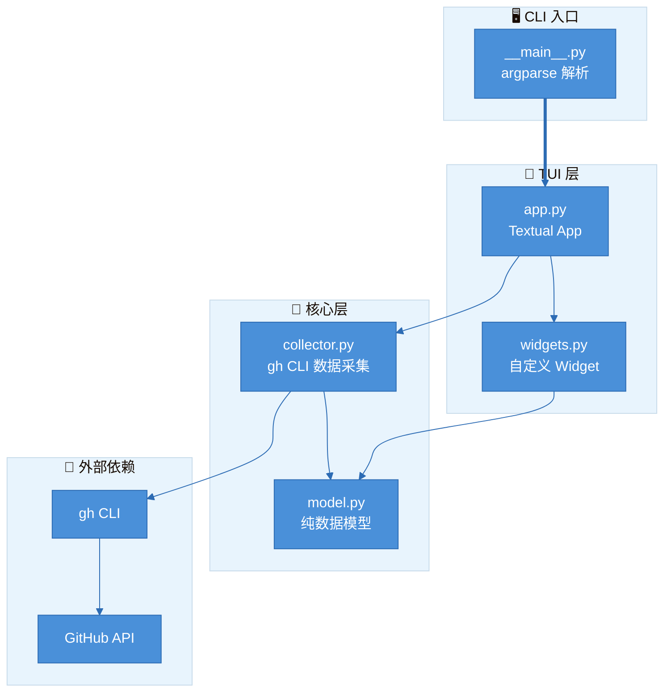

# gh_watcher — GitHub 聚合活动看板 TUI 设计文档

> 日期: 2026-04-22
> 状态: Draft

## 背景

FdWatcher 项目是一个 Python TUI 工具集合，已有 fd_watcher（文件描述符监控）和 cpu_watcher（CPU 函数级性能监控）。用户需要一个新工具来聚合查看自己贡献的 GitHub 项目的最近活动（Issues、PRs、Notifications），以只读看板的形式在终端中呈现。

## 目标

- 聚合展示用户参与的 GitHub 项目的 Issues、Pull Requests、Notifications
- 只读看板，按 Enter 打开浏览器跳转到对应 GitHub 页面
- 定时自动刷新（默认 60s），也支持手动刷新
- 数据来源自动发现（基于 GitHub 用户名）+ 手动配置 repo 列表
- 复用 FdWatcher 项目已有的架构模式和 Textual 框架

## 非目标

- 不在 TUI 内执行写操作（评论、打标签、关闭 issue 等）
- 不处理 GitHub Actions / Workflow 状态
- 不做跨用户的团队看板

## 架构概览



### 分层职责

| 层 | 文件 | 职责 |
|---|---|---|
| CLI | `__main__.py` | 参数解析、环境检测、启动 App |
| 数据模型 | `model.py` | frozen dataclass 定义，零外部依赖 |
| 数据采集 | `collector.py` | 封装 gh CLI 调用，实现 DataCollector Protocol |
| TUI 主入口 | `app.py` | Textual App，消息驱动，定时刷新 |
| Widget | `widgets.py` | IssueTable / PRTable / NotifPanel / StatusBar |

## 数据模型

所有模型使用 `frozen=True, slots=True` 的 dataclass，保持不可变性。

### Issue

```python
@dataclass(frozen=True, slots=True)
class Issue:
    repo: str              # "owner/repo"
    number: int
    title: str
    state: str             # "open" / "closed"
    author: str
    labels: tuple[str, ...]
    comments: int
    created_at: str        # ISO 8601
    updated_at: str
    url: str               # GitHub web URL
```

### PullRequest

```python
@dataclass(frozen=True, slots=True)
class PullRequest:
    repo: str
    number: int
    title: str
    state: str             # "open" / "closed" / "merged"
    author: str
    labels: tuple[str, ...]
    reviews: int
    draft: bool
    mergeable: bool
    created_at: str
    updated_at: str
    url: str
```

### Notification

```python
@dataclass(frozen=True, slots=True)
class Notification:
    id: str
    repo: str
    title: str
    type: str              # "Issue" / "PullRequest" / "Release" / ...
    reason: str            # "subscribed" / "review_requested" / "mention" / ...
    unread: bool
    updated_at: str
    url: str
```

### DashboardSnapshot

```python
@dataclass(frozen=True, slots=True)
class DashboardSnapshot:
    timestamp: str
    username: str
    issues: tuple[Issue, ...]
    pull_requests: tuple[PullRequest, ...]
    notifications: tuple[Notification, ...]
    repos: tuple[str, ...]
```

### DataCollector Protocol

```python
@runtime_checkable
class DataCollector(Protocol):
    def collect(self) -> DashboardSnapshot | None: ...
    def check_ready(self) -> tuple[bool, str]: ...
    def get_target_display(self) -> str: ...
```

## 数据采集层

### gh CLI 调用策略

1. **用户信息**: `gh api /user` → 获取 username（启动时调用一次）
2. **Issues**: `gh search issues --involves={user} --state=open --sort=updated --limit={limit} --json ...`
3. **PRs**: `gh search prs --involves={user} --state=open --sort=updated --limit={limit} --json ...`
4. **Notifications**: `gh api /notifications`
5. **Repo 过滤（可选）**: 如果用户配置了 `--repos`，则在 search 查询中追加 `repo:{owner/repo}` 限定范围；否则全局搜索用户参与的所有 repos

使用 `gh search` 子命令而非 `gh api /search/issues`，因为 `gh search` 原生支持 `--json` 格式化输出，省去手动拼 query string。

### 调用方式

- 使用 `subprocess.run` 调用 `gh` 子命令，返回 JSON
- 和 cpu_watcher 调用 adb 的模式一致
- `check_ready()` 通过 `gh auth status` 验证认证状态
- 串行调用（3 次 gh 调用），60s 刷新周期下几秒延迟可接受
- GitHub Search API rate limit: 30 requests/min（认证用户），60s 刷新周期下 3 次调用完全足够

### Repo 配置

支持两种方式指定关注的 repos：

1. **命令行参数**: `--repos owner/repo1,org/repo2`
2. **配置文件**: `~/.config/gh_watcher/repos.txt`，每行一个 `owner/repo`

配置文件示例：
```
# 手动关注的 repos
nickclaw/FdWatcher
nickclaw/cpu_watcher
aosp-mirror/platform_frameworks_base
```

自动发现的 repos 与手动配置合并去重。

### CollectorConfig

```python
@dataclass(frozen=True, slots=True)
class CollectorConfig:
    username: str = ""             # GitHub 用户名（空则自动检测）
    extra_repos: tuple[str, ...] = ()  # 额外关注的 repos
    interval_s: float = 60.0      # 刷新间隔（秒）
    limit: int = 30               # 每类最多条目数
    gh_bin: str = "gh"            # gh 可执行路径
    include_closed: bool = False  # 是否包含已关闭的 issues/PRs
```

## TUI 设计

### 布局

使用 Textual 的 `TabbedContent` 组件，3 个 Tab 面板：

```
┌─────────────── gh_watcher ─ @wudongsheng1 ───────────────┐
│ [Issues]  [Pull Requests]  [Notifications]               │
├──────────────────────────────────────────────────────────┤
│ Repo         │ #   │ Title              │ State │ Updated│
│──────────────│─────│────────────────────│───────│────────│
│ user/repo1   │ 42  │ Fix memory leak... │ 🟢    │ 2h ago │
│ org/repo2    │ 108 │ Add new feature... │ 🟡    │ 5h ago │
│ ...          │     │                    │       │        │
├──────────────────────────────────────────────────────────┤
│ ↑/↓ 选择  / 搜索  Enter 打开  r 刷新  q 退出           │
│ 🔄 Last: 19:43:21  │  Next: 42s  │  12 items            │
└──────────────────────────────────────────────────────────┘
```

### Tab 内容

**Issues Tab** — DataTable 列：
| Repo | # | Title | State | Labels | Comments | Updated |
|---|---|---|---|---|---|---|

**PRs Tab** — DataTable 列：
| Repo | # | Title | State | Draft | Reviews | Updated |
|---|---|---|---|---|---|---|

**Notifications Tab** — DataTable 列：
| Repo | Type | Title | Reason | Unread | Updated |
|---|---|---|---|---|---|

### 快捷键

| 按键 | 功能 |
|---|---|
| `↑/↓` 或 `j/k` | 导航选择行 |
| `Tab` | 切换 Issues / PRs / Notifications 面板 |
| `/` | 搜索过滤 |
| `Enter` | 用默认浏览器打开选中条目 |
| `r` | 手动刷新 |
| `s` | 切换排序（按时间/按 repo/按状态） |
| `f` | 过滤菜单（按 repo/按状态/按 label） |
| `q` | 退出 |

### 状态栏

底部显示：
- 上次刷新时间
- 下次刷新倒计时
- 当前条目总数
- 采集状态（正在刷新 / 刷新完成 / 错误信息）

### 消息驱动

和 cpu_watcher 一致，后台线程采集 → post Message → 主线程渲染：

```python
class SnapshotUpdated(Message):
    def __init__(self, snapshot: DashboardSnapshot) -> None:
        self.snapshot = snapshot
        super().__init__()

class CollectorError(Message):
    def __init__(self, error: str) -> None:
        self.error = error
        super().__init__()
```

## CLI 接口

```bash
python -m gh_watcher                               # 默认：自动发现 + 60s 刷新
python -m gh_watcher --repos user/repo1,org/repo2  # 手动指定 repos
python -m gh_watcher --interval 120                # 120s 刷新周期
python -m gh_watcher --limit 50                    # 每类最多 50 条
python -m gh_watcher --gh /usr/local/bin/gh        # 自定义 gh 路径
python -m gh_watcher --include-closed              # 包含已关闭的 issues/PRs
```

顶层便捷脚本 `gh_watcher.py`：
```python
from gh_watcher.__main__ import main
if __name__ == "__main__":
    main()
```

## 项目文件结构

```
gh_watcher/
├── __init__.py        # __version__ = "0.1.0"
├── __main__.py        # CLI argparse 入口
├── model.py           # 纯数据模型 (frozen dataclass, Protocol)
├── collector.py       # gh CLI 数据采集器
├── app.py             # Textual App (GhWatcherApp)
├── messages.py        # Textual Message 定义
└── widgets.py         # IssueTable, PRTable, NotifPanel, StatusBar, FilterInput
gh_watcher.py          # 顶层便捷脚本
```

## 错误处理

| 场景 | 处理方式 |
|---|---|
| gh CLI 未安装 | `check_ready()` 返回 `(False, "gh CLI not found")`, App 显示安装指引后退出 |
| gh 未认证 | `check_ready()` 返回 `(False, "Run 'gh auth login' first")`, App 显示提示后退出 |
| API rate limit | collector 返回 None，TUI 显示上次有效数据 + rate limit 警告 |
| 网络错误 | collector 返回 None，TUI 显示上次有效数据 + 错误信息 |
| 单个 repo 访问失败 | 跳过该 repo，继续采集其他 repos，状态栏显示跳过信息 |

## 依赖

- **textual** >= 0.50.0（已安装 8.2.3）
- **rich**（textual 自带）
- **gh CLI**（外部依赖，需用户自行安装）

无新增 Python 包依赖。

## 测试策略

- **单元测试**: model.py 数据结构创建与不可变性、collector.py 的 JSON 解析逻辑（mock subprocess）
- **集成测试**: 端到端的 gh CLI 调用验证（需真实 gh 认证环境）
- **TUI 测试**: Textual 的 pilot API 驱动 widget 渲染和快捷键交互
